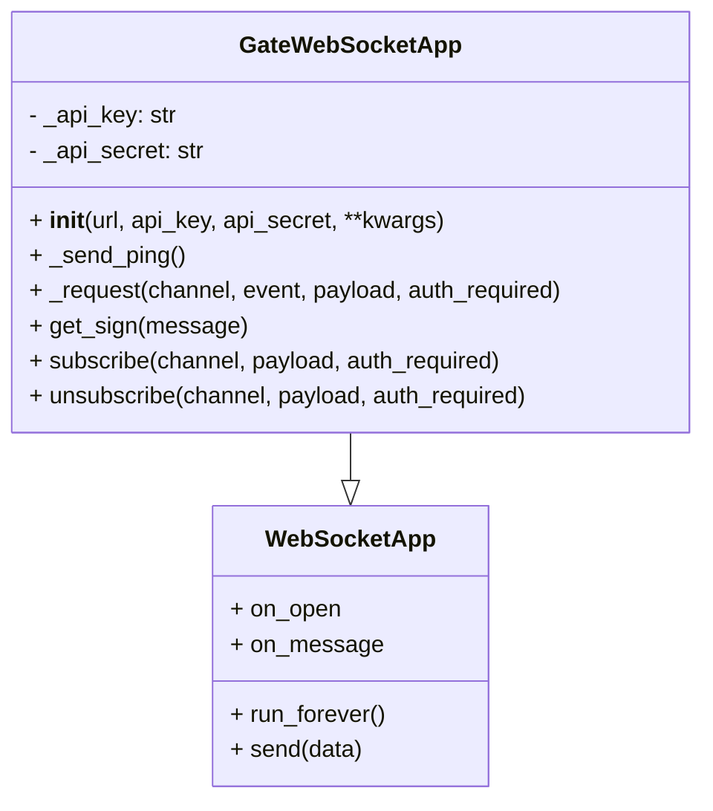
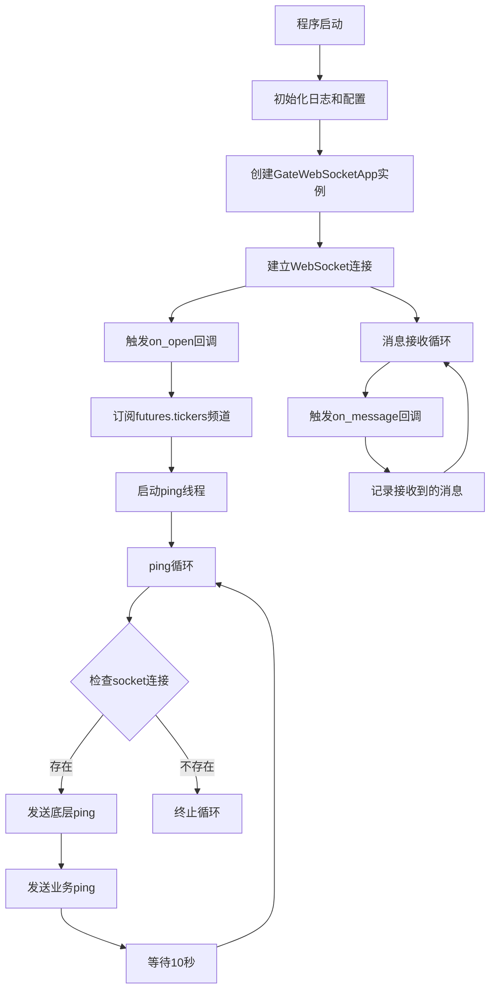
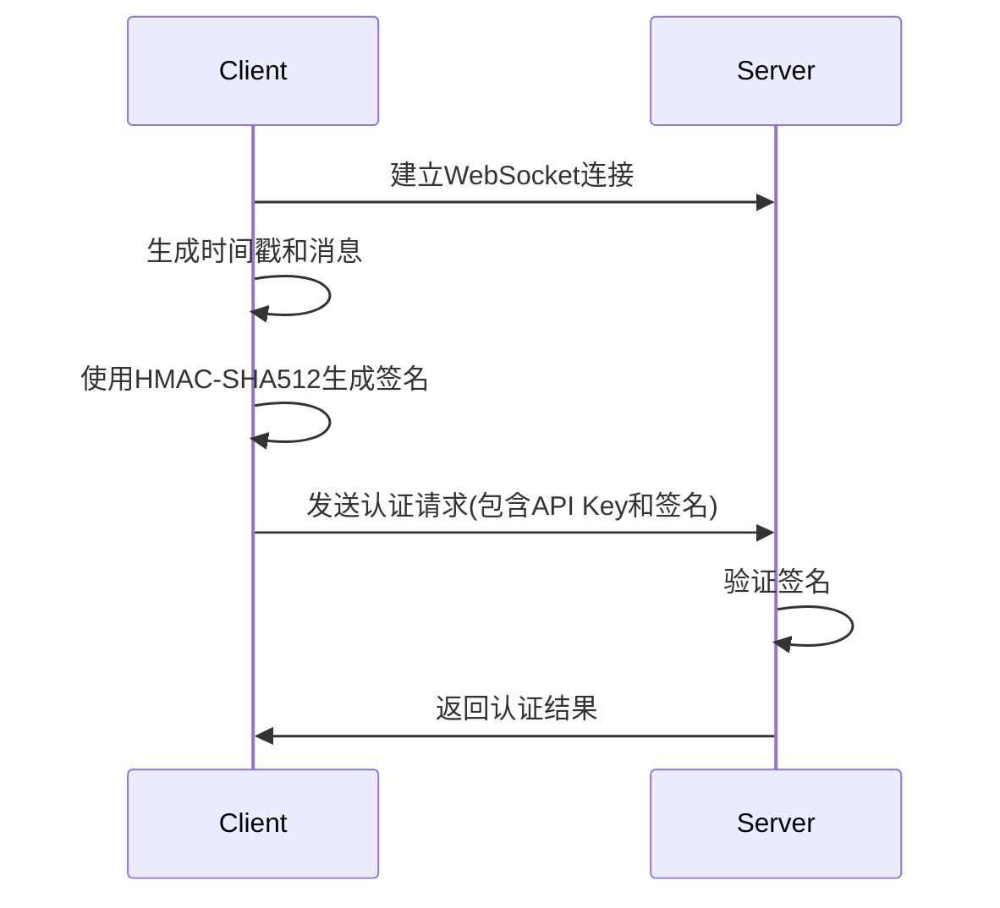

# Gate.io WebSocket 客户端代码流程说明

## 概述
这是一个用于连接 Gate.io 交易所 WebSocket API 的 Python 客户端，主要用于获取期货行情数据。

## 代码结构



## 完整执行流程



## 核心组件说明

### 1. GateWebSocketApp 类
继承自 `WebSocketApp`，封装了 Gate.io 特定的 WebSocket 功能。

#### 主要方法：
- `__init__()`: 初始化连接参数和认证信息
- `_send_ping()`: 定期发送ping消息保持连接
- `_request()`: 构造并发送WebSocket请求
- `get_sign()`: 生成HMAC-SHA512签名
- `subscribe()`: 订阅指定频道
- `unsubscribe()`: 取消订阅指定频道

### 2. 回调函数
- `on_open(ws)`: 连接建立时自动订阅行情频道
- `on_message(ws, message)`: 处理接收到的消息

## 认证流程



## 数据流示例

### 订阅请求
```json
{
  "time": 1762761147,
  "channel": "futures.tickers",
  "event": "subscribe",
  "payload": ["BTC_USDT"]
}
```

### 行情数据响应
```json
{
  "time": 1762761148,
  "time_ms": 1762761148773,
  "channel": "futures.tickers",
  "event": "update",
  "result": [{
    "contract": "BTC_USDT",
    "last": "106367.7",
    "change_percentage": "4.4093",
    "total_size": "716781844",
    "volume_24h": "690832030",
    "mark_price": "106367.7",
    "funding_rate": "0.000047",
    "index_price": "106414.4",
    "low_24h": "101462.0",
    "high_24h": "106659.8"
  }]
}
```

## 环境要求

### 依赖包
```bash
pip install websocket-client
```

### Python 版本
- Python 3.6+

## 运行说明

1. 配置您的 API 密钥和密钥
2. 运行程序：
```bash
python 1110_m.py
```

## 注意事项

- 示例中使用的是测试API密钥，实际使用时请替换为您自己的密钥
- 程序会自动订阅 BTC_USDT 合约的行情数据
- 每10秒发送一次ping消息保持连接活跃
- 所有接收到的消息都会记录到日志中

## 故障排除

如果连接失败，请检查：
- API 密钥和密钥是否正确
- 网络连接是否正常
- Gate.io WebSocket 服务状态