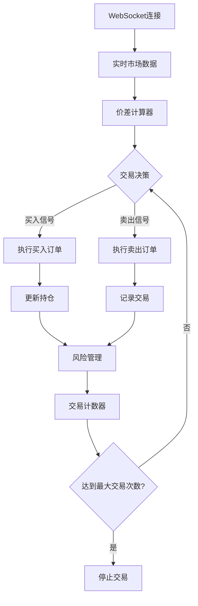

# 基于 LLM 和多智能体的量化交易学习项目

[](https://python.org)
[](LICENSE)
[](docs)

一个综合性的量化交易学习项目，使用大型语言模型（LLM）和多智能体架构实现自动化的加密货币期货交易系统。项目专注于价差交易策略，配备实时市场监控和强大的风险管理功能。

## 🎯 项目概述

本仓库包含生产级交易系统和学习材料，涵盖：

- **自动化期货交易**：Gate.io 和 Bybit API 集成，实时 WebSocket 数据流
- **价差交易策略**：从微小价格差异中获利，目标利润率 0.05%
- **风险管理**：多层安全控制和持仓监控
- **教育资源**：API 集成和交易逻辑的分步学习示例

## ✨ 核心特性

### 🚀 生产级交易系统

- **`enhanced_futures_trader.py`**：完整的自动化交易机器人
- **实时市场数据**：基于 WebSocket 的价格行情和订单管理
- **智能交易**：自动买入→监控→卖出逻辑，配备价差计算
- **风险控制**：持仓限制、每日亏损上限、余额监控

### 📊 交易策略

```
买入逻辑：无持仓 → 市价买入 → 持仓
卖出逻辑：有持仓 + 价差 ≥ 0.05% → 市价卖出 → 记录利润
风险控制：仅单向持仓，可配置交易限制
```

### 🛡️ 安全特性

- **测试网支持**：在交易所测试网上安全测试
- **手动停止**：Ctrl+C 紧急停止功能
- **可配置限制**：交易次数、持仓规模、每日亏损上限
- **全面日志**：详细交易记录和系统状态

## 🏗️ 系统架构

### 核心组件



### 技术栈

- **Python 3.7+**：核心编程语言
- **WebSocket**：实时市场数据流
- **REST APIs**：市场数据和账户信息
- **十进制运算**：精确的财务计算
- **多线程**：并发操作和监控

## 🚀 快速开始

### 环境要求

```bash
# 安装必要的 Python 包
pip install websocket-client requests apscheduler websocket

# 验证 Python 版本（需要 3.7+）
python --version
```

### 🔑 ~~API 密钥使用说明~~

> ~~**重要提醒**：我在代码中保留了我账号的模拟交易密钥供大家测试学习使用。~~
>
> ~~**强烈建议**：希望大家申请自己的账号，后续使用自己的 API 密钥进行交易测试。~~
>
> ~~**长期使用**：如果要长期使用这些密钥，请与我打招呼，我们可以讨论潜在风险和规避措施。~~
>
> ~~**共同进步**：希望大家能够一起学习进步，在量化交易的道路上越走越远！~~

### 配置设置

创建 `config.json` 文件，配置交易所 API 凭证：

```json
{
    "api": {
        "url": "wss://ws-testnet.gate.com/v4/ws/futures/usdt",
        "key": "YOUR_API_KEY",
        "secret": "YOUR_API_SECRET"
    },
    "trading": {
        "contracts": ["BTC_USDT"],
        "amount": 1,
        "max_trades": 10,
        "spread_threshold": 0.0005
    },
    "risk": {
        "max_position_size": 10,
        "max_daily_loss": 500,
        "min_balance_ratio": 0.2
    }
}
```

### 运行交易机器人

```bash
# 使用默认配置
python enhanced_futures_trader.py

# 自定义参数
python enhanced_futures_trader.py \
    --contracts BTC_USDT ETH_USDT \
    --amount 2 \
    --max-trades 5 \
    --spread-threshold 0.0003

# 使用自定义配置文件
python enhanced_futures_trader.py --config my_config.json
```

## 📁 项目结构

```
├── enhanced_futures_trader.py    # 主交易系统
├── config.json                   # 配置文件（需要手动创建）
├── 1102.py                       # Bybit REST API 市场数据示例
├── 1105.py                       # 额外的 API 测试示例
├── 1110_m.py                     # Gate.io WebSocket 基础学习示例
├── 1110_o.py                     # WebSocket 高级使用示例
├── 1110_m_readme.md              # 1110_m.py 的详细说明文档
├── README_EN.md                  # 英文文档
├── README.md                     # 中文文档（本文件）
├── SPREAD_TRADING_GUIDE.md       # 详细使用指南
├── SPREAD_TRADING_SUMMARY.md     # 项目架构总结
├── CLAUDE.md                     # Claude Code 开发指导
└── .gitignore                    # Git 忽略文件
```

## 📖 学习资源

### API 集成示例

- **`1102.py`**：Bybit REST API 市场数据获取
- **`1105.py`**：额外的 API 测试和学习示例
- **`1110_m.py`**：基础 Gate.io WebSocket 连接和认证
- **`1110_o.py`**：高级 WebSocket 使用模式
- **`1110_m_readme.md`**：1110_m.py 的详细说明文档

### 文档资料

- **[SPREAD_TRADING_GUIDE.md](SPREAD_TRADING_GUIDE.md)**：详细使用指南
- **[SPREAD_TRADING_SUMMARY.md](SPREAD_TRADING_SUMMARY.md)**：架构和策略概述
- **[CLAUDE.md](CLAUDE.md)**：Claude Code 开发指导

## 🎯 交易策略详解

### 价差交易逻辑

1. **市场入场**：无持仓时，以当前卖价市价买入
2. **持仓监控**：持续计算价差：`|当前价格 - 入场价格| / 入场价格`
3. **获利平仓**：价差 ≥ 0.05% 时，以当前买价市价卖出
4. **风险管理**：执行持仓限制、每日亏损上限、交易次数限制

### 关键参数

| 参数                  | 描述                           | 默认值 |
| --------------------- | ------------------------------ | ------ |
| `spread_threshold`  | 最小利润价差（0.05% = 0.0005） | 0.0005 |
| `max_trades`        | 每次会话最大交易次数           | 10     |
| `amount`            | 每次交易合约数量               | 1      |
| `max_position_size` | 最大开仓数量                   | 10     |
| `max_daily_loss`    | 每日亏损上限（USDT）           | 500    |

## 📊 交易输出示例

```
2025-11-11 12:30:15 - INFO - 🚀 Gate.io 期货价差交易系统启动
2025-11-11 12:30:16 - INFO - 🔗 WebSocket 连接已建立
2025-11-11 12:30:20 - INFO - 🟢 买入机会: BTC_USDT - 价格: 95000.50
2025-11-11 12:30:21 - INFO - ✅ 买入成功: BTC_USDT 1 @ 95000.50
2025-11-11 12:31:45 - INFO - 🔴 卖出机会: BTC_USDT - 价差 0.0450% ≤ 0.0500%
2025-11-11 12:31:46 - INFO - ✅ 卖出成功: BTC_USDT - 盈亏: 42.75 USDT (0.0450%)
```

## ⚠️ 重要安全提示

### 🔒 安全注意事项

- **绝不分享 API 凭证**或将其提交到版本控制
- **使用测试网环境**进行开发和测试
- **实盘交易时从小额开始**

### ⚠️ 风险警告

- **市场风险**：极端市场条件可能无法达到目标价差
- **技术风险**：网络问题可能影响订单执行
- **API 限制**：注意交易所的调用频率限制
- **财务风险**：只交易您能承受损失的资金

### 🛡️ 最佳实践

1. **充分测试**：在测试网上彻底测试策略
2. **保守参数**：实盘交易时使用保守设置
3. **持续监控**：监控系统日志和账户余额
4. **应急预案**：准备手动干预方案

## 🔄 支持的交易所

### Gate.io

- **WebSocket**：实时期货交易
- **测试网**：`wss://ws-testnet.gate.com/v4/ws/futures/usdt`
- **生产网**：`wss://ws.gate.com/v4/ws/futures/usdt`
- **认证方式**：HMAC-SHA512 签名

### Bybit

- **REST API**：市场数据和价格比较
- **端点**：`https://api.bybit.com/v5/market/tickers`
- **用途**：价格验证和市场分析

## 🤝 贡献

欢迎贡献！请随时提交 Pull Request。对于重大更改，请先开启 issue 讨论您想要更改的内容。

### 开发指南

- 遵循现有代码风格和结构
- 添加全面的错误处理
- 包含详细日志
- 在测试网上彻底测试
- 更新文档

## 📄 许可证

本项目基于 MIT 许可证开源 - 详见 [LICENSE](LICENSE) 文件。

## 🔗 相关项目

- **Gate.io API 文档**：[https://www.gate.io/docs/developers/apiv4/](https://www.gate.io/docs/developers/apiv4/)
- **Bybit API 文档**：[https://bybit-exchange.github.io/docs/v5/](https://bybit-exchange.github.io/docs/v5/)
- **WebSocket 客户端库**：[https://github.com/websocket-client/websocket-client](https://github.com/websocket-client/websocket-client)

## 📞 支持

如有问题和支持需求：

- 📖 查看中文文档
- 🔍 研究代码库中的学习示例
- 🐛 提交 bug 或功能请求的 issues
- 📧 使用 GitHub Discussions 进行一般性讨论

---

**⚠️ 免责声明**：本项目仅供教育目的使用。加密货币交易涉及重大亏损风险。使用风险自负，切勿交易超过您能承受损失的资金。
