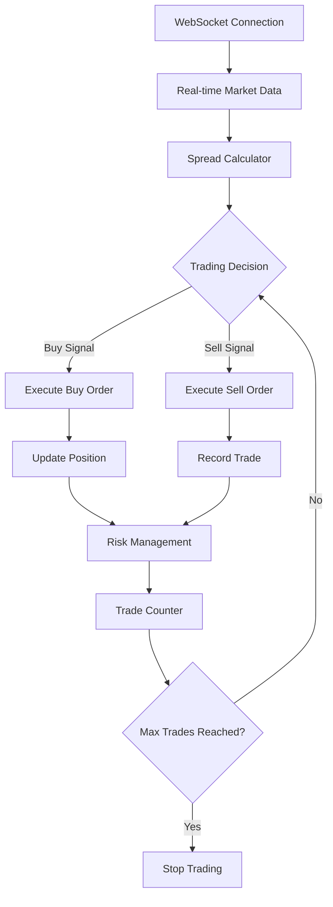

# Quantitative Trading Learning with LLM and Multi-agents

[](https://python.org)
[](LICENSE)
[](docs)

A comprehensive quantitative trading learning project that implements automated cryptocurrency futures trading systems using Large Language Models (LLM) and multi-agent architecture. The project focuses on spread trading strategies with real-time market monitoring and robust risk management.

## 🎯 Project Overview

This repository contains production-ready trading systems and learning materials for:

- **Automated Futures Trading**: Gate.io and Bybit API integration with real-time WebSocket feeds
- **Spread Trading Strategy**: Profit from small price differences with 0.05% target margins
- **Risk Management**: Multi-layer safety controls and position monitoring
- **Educational Resources**: Step-by-step examples for learning API integration and trading logic

## ✨ Key Features

### 🚀 Production Trading System

- **`enhanced_futures_trader.py`**: Complete automated trading bot
- **Real-time Market Data**: WebSocket-based price feeds and order management
- **Intelligent Trading**: Automatic buy → monitor → sell logic with spread calculations
- **Risk Controls**: Position limits, daily loss limits, and balance monitoring

### 📊 Trading Strategy

```
Buy Logic:    No Position → Market Buy → Hold Position
Sell Logic:   Position + Spread ≥ 0.05% → Market Sell → Record Profit
Risk Control: Single direction positions only, configurable trade limits
```

### 🛡️ Safety Features

- **Testnet Support**: Safe testing on exchange testnets
- **Manual Stop**: Ctrl+C emergency stop functionality
- **Configurable Limits**: Trade count, position size, and daily loss caps
- **Comprehensive Logging**: Detailed trade records and system status

## 🏗️ Architecture

### Core Components



### Technology Stack

- **Python 3.7+**: Core programming language
- **WebSocket**: Real-time market data feeds
- **REST APIs**: Market data and account information
- **Decimal Arithmetic**: Precise financial calculations
- **Threading**: Concurrent operations and monitoring

## 🚀 Quick Start

### Prerequisites

```bash
# Install required packages
pip install websocket-client requests apscheduler websocket

# Verify Python version (requires 3.7+)
python --version
```

### 🔑 API Key Usage Notice

> **Important Notice**: I have included my demo trading API keys in the code for everyone to test and learn with.
>
> **Strong Recommendation**: I encourage everyone to apply for their own accounts and use their own API keys for trading tests going forward.
>
> **Long-term Usage**: If you plan to use these keys long-term, please contact me so we can discuss potential risks and mitigation strategies.
>
> **Let's Grow Together**: I hope we can all learn and progress together on our quantitative trading journey!

### Configuration

Create `config.json` with your exchange API credentials:

```json
{
    "api": {
        "url": "wss://ws-testnet.gate.com/v4/ws/futures/usdt",
        "key": "YOUR_API_KEY",
        "secret": "YOUR_API_SECRET"
    },
    "trading": {
        "contracts": ["BTC_USDT"],
        "amount": 1,
        "max_trades": 10,
        "spread_threshold": 0.0005
    },
    "risk": {
        "max_position_size": 10,
        "max_daily_loss": 500,
        "min_balance_ratio": 0.2
    }
}
```

### Run the Trading Bot

```bash
# Default configuration
python enhanced_futures_trader.py

# Custom parameters
python enhanced_futures_trader.py \
    --contracts BTC_USDT ETH_USDT \
    --amount 2 \
    --max-trades 5 \
    --spread-threshold 0.0003

# Using custom config
python enhanced_futures_trader.py --config my_config.json
```

## 📁 Project Structure

```
├── enhanced_futures_trader.py    # Main production trading system
├── config.json                   # Configuration file (create manually)
├── 1102.py                       # Bybit REST API market data example
├── 1105.py                       # Additional API testing example
├── 1110_m.py                     # Gate.io WebSocket basic learning example
├── 1110_o.py                     # WebSocket advanced usage example
├── 1110_m_readme.md              # Detailed documentation for 1110_m.py
├── README_EN.md                  # This English documentation
├── README.md                     # Chinese documentation
├── SPREAD_TRADING_GUIDE.md       # Detailed usage guide (Chinese)
├── SPREAD_TRADING_SUMMARY.md     # Project architecture summary (Chinese)
├── CLAUDE.md                     # Claude Code development guidance
└── .gitignore                    # Git ignore file
```

## 📖 Learning Resources

### API Integration Examples

- **`1102.py`**: Bybit REST API market data fetching
- **`1105.py`**: Additional API testing and learning examples
- **`1110_m.py`**: Basic Gate.io WebSocket connection and authentication
- **`1110_o.py`**: Advanced WebSocket usage patterns
- **`1110_m_readme.md`**: Detailed documentation for 1110_m.py

### Documentation

- **[SPREAD_TRADING_GUIDE.md](SPREAD_TRADING_GUIDE.md)**: Comprehensive usage guide (Chinese)
- **[SPREAD_TRADING_SUMMARY.md](SPREAD_TRADING_SUMMARY.md)**: Architecture and strategy overview (Chinese)
- **[CLAUDE.md](CLAUDE.md)**: Development guidance for Claude Code

## 🎯 Trading Strategy Details

### Spread Trading Logic

1. **Market Entry**: When no position exists, place market buy order at current ask price
2. **Position Monitoring**: Continuously calculate spread: `|current_price - entry_price| / entry_price`
3. **Profit Taking**: When spread ≥ 0.05%, place market sell order at current bid price
4. **Risk Management**: Enforce position limits, daily loss caps, and trade count limits

### Key Parameters

| Parameter             | Description                            | Default Value |
| --------------------- | -------------------------------------- | ------------- |
| `spread_threshold`  | Minimum profit spread (0.05% = 0.0005) | 0.0005        |
| `max_trades`        | Maximum trades per session             | 10            |
| `amount`            | Contract size per trade                | 1             |
| `max_position_size` | Maximum open position size             | 10            |
| `max_daily_loss`    | Daily loss limit in USDT               | 500           |

## 📊 Sample Trading Output

```
2025-11-11 12:30:15 - INFO - 🚀 Gate.io Futures Spread Trading System Started
2025-11-11 12:30:16 - INFO - 🔗 WebSocket connection established
2025-11-11 12:30:20 - INFO - 🟢 Buy opportunity: BTC_USDT - Price: 95000.50
2025-11-11 12:30:21 - INFO - ✅ Buy successful: BTC_USDT 1 @ 95000.50
2025-11-11 12:31:45 - INFO - 🔴 Sell opportunity: BTC_USDT - Spread 0.0450% ≤ 0.0500%
2025-11-11 12:31:46 - INFO - ✅ Sell successful: BTC_USDT - P&L: 42.75 USDT (0.0450%)
```

## ⚠️ Important Safety Notes

### 🔒 Security

- **Never share API credentials** or commit them to version control
- **Use testnet environments** for development and testing
- **Start with small amounts** when moving to production

### ⚠️ Risk Warnings

- **Market Risk**: Extreme market conditions may prevent achieving target spreads
- **Technical Risk**: Network issues may affect order execution
- **API Limits**: Be aware of exchange rate limiting
- **Financial Risk**: Only trade with funds you can afford to lose

### 🛡️ Best Practices

1. **Extensive Testing**: Thoroughly test strategies on testnets
2. **Conservative Parameters**: Use conservative settings for live trading
3. **Continuous Monitoring**: Monitor system logs and account balance
4. **Emergency Procedures**: Have manual intervention plans ready

## 🔄 Supported Exchanges

### Gate.io

- **WebSocket**: Real-time futures trading
- **Testnet**: `wss://ws-testnet.gate.com/v4/ws/futures/usdt`
- **Production**: `wss://ws.gate.com/v4/ws/futures/usdt`
- **Authentication**: HMAC-SHA512 signature

### Bybit

- **REST API**: Market data and price comparison
- **Endpoint**: `https://api.bybit.com/v5/market/tickers`
- **Usage**: Price validation and market analysis

## 🤝 Contributing

Contributions are welcome! Please feel free to submit a Pull Request. For major changes, please open an issue first to discuss what you would like to change.

### Development Guidelines

- Follow existing code style and structure
- Add comprehensive error handling
- Include detailed logging
- Test thoroughly on testnets
- Update documentation

## 📄 License

This project is licensed under the MIT License - see the [LICENSE](LICENSE) file for details.

## 🔗 Related Projects

- **Gate.io API Documentation**: [https://www.gate.io/docs/developers/apiv4/](https://www.gate.io/docs/developers/apiv4/)
- **Bybit API Documentation**: [https://bybit-exchange.github.io/docs/v5/](https://bybit-exchange.github.io/docs/v5/)
- **WebSocket Client Library**: [https://github.com/websocket-client/websocket-client](https://github.com/websocket-client/websocket-client)

## 📞 Support

For questions and support:

- 📖 Check the comprehensive documentation in Chinese
- 🔍 Review the learning examples in the codebase
- 🐛 Open issues for bugs or feature requests
- 📧 Use GitHub discussions for general questions

---

**⚠️ Disclaimer**: This project is for educational purposes only. Cryptocurrency trading involves substantial risk of loss. Use at your own risk and never trade more than you can afford to lose.
